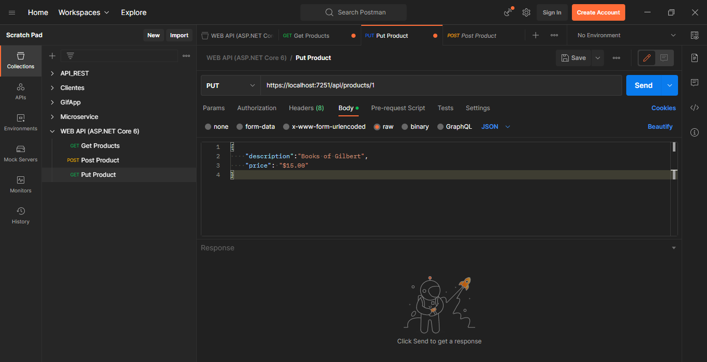

# API WEB CRUD (ASP .NET Core 6)
- This is an API that does the function of a basic CRUD. The connection is made directly through Microsoft SQL Server and the POSTMAN tool is used for testing.

## Tools Used:

